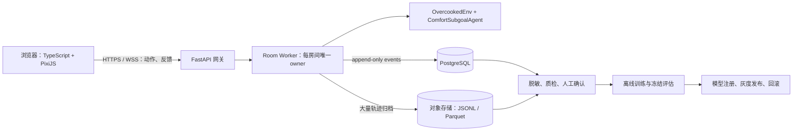
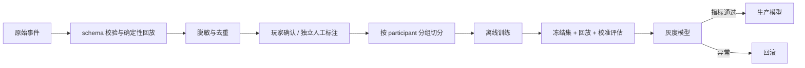

# DURF Web 迁移与远程数据闭环方案

## 当前状态（2026-08-27）

远程研究体验版已部署：[DURF 暖炉厨房实验室](https://durf-kitchen-lab-study.active-wren-5858.chatgpt.site)。当前版本用于尽快验证浏览器 UI、三分类、Route1/Route2 展示和匿名数据闭环；它使用浏览器 TypeScript 状态机与冻结模型导出。原地图的格子、设施和出生点逐字符锁定，Pygame 通道保持独立且测试通过。站点采用公开网址，不使用邮件邀请。

当前体验版不等于 Python 环境的逐步动力学完全复刻。需要论文级线上实验时，下一阶段仍应按下文方案把 Python `OvercookedEnv + ComfortSubgoalAgent` 作为服务端权威状态；浏览器只负责输入与显示。这样既保留桌面 Pygame，也能让 Web 与训练代码共享同一条更新链。

## 结论

推荐采用“浏览器只负责输入与像素渲染，Python 服务端负责权威状态、AI 推理和日志”的架构。不要把 Pygame、TensorFlow 或 RLlib 直接搬进浏览器，也不要把旧 Flask Demo 原样恢复。

首发建议做 **Human + AI 单人房间**。它最接近当前实验，变量少，也最容易保证现有轨迹与学习结果一致。远程 Human + Human 匹配放到第二阶段。



## 当前代码如何拆

先从 `durf/group_a/play_with_baseline.py` 抽出不依赖 Pygame 的 `GameSession`，桌面版和 Web 版共用同一状态机。

| 当前职责 | 新位置 | 说明 |
|---|---|---|
| 环境 reset / step | `durf/game/session.py` | 服务端唯一权威状态；固定 2 Hz tick |
| AI `act` 与 transition | `durf/game/agents.py` | 每个房间独立实例，禁止共享可变 learner |
| 反馈提交与 learner update | `durf/game/feedback.py` | 返回结构化分类、grounding、更新 trace |
| CSV 本地日志 | `durf/telemetry/events.py` | 先写 append-only 事件，再异步落库 |
| Pygame 键盘与绘制 | 保留桌面 adapter | 只消费 `GameSession` 快照 |
| WebSocket | `durf/web/rooms.py` | 校验 seat token、序号、重连与房间状态 |
| 浏览器渲染 | `web/src/game/` | PixiJS Canvas；使用 16×16 图集最近邻缩放 |

仓库历史 `d4c0626^:src/overcooked_demo/` 可参考其房间协议、服务端 tick 和浏览器图集映射，但它使用旧 Flask-SocketIO、单进程内存房间和宽松 CORS，只能作为参考，不能直接上线。

## 房间与同步规则

房间状态固定为：

`WAITING → COUNTDOWN → RUNNING ↔ PAUSED → ENDED / ABORTED`

- 浏览器发送 `action_intent {client_seq, action, client_time}`，不发送完整状态。
- 服务端每 tick 取截止时间前最新动作；缺失动作使用 `STAY`。
- 服务端返回 `action_ack` 和权威 `state_snapshot`，记录 requested 与 executed action，不能只记录按键。
- 一个房间只能由一个 worker 推进，避免重复 step。
- 断线立即暂停，保留 30–60 秒重连窗口；掉线不能被误记为玩家主动连续 `STAY`。
- HA 模式固定 AI 为 player 0、玩家为 player 1，保持当前训练与日志语义。
- HH 模式增加 `feedback_target=ai|human_partner|game|ui`；针对真人队友的话不能混入 AI 偏好训练集。

FastAPI 官方支持 WebSocket JSON 消息、鉴权依赖、多客户端和断线处理；PixiJS 8 的 Application 可统一管理 WebGL/WebGPU renderer 和 ticker。参考：[FastAPI WebSockets](https://fastapi.tiangolo.com/advanced/websockets/)、[PixiJS Application](https://pixijs.com/8.x/guides/components/application)。

## 数据契约 v3

每条事件必须有 `schema_version`、全局唯一 `event_id`、`session_id`、匿名 `participant_id`、服务端时间、`engine_git_sha`、`build_id`、`model_id` 和 `model_sha256`。

### `trajectory_step`

```json
{
  "event_type": "trajectory_step",
  "episode": 1,
  "server_tick": 42,
  "state_before": {},
  "requested_joint_actions": [4, 2],
  "executed_joint_actions": [4, 2],
  "state_after": {},
  "reward": 0.0,
  "done": false,
  "network": {"client_seq": 83, "latency_ms": 71, "late": false}
}
```

另外保存“初始完整状态 + 执行过的 joint actions”，用于确定性回放；当前 `state_facts` 继续用于事件检测和检索。

### `feedback_event`

```json
{
  "event_type": "feedback_event",
  "feedback_event_id": "...",
  "anchor_total_step": 42,
  "lookback_window": [30, 42],
  "language": "en",
  "feedback_target": "ai",
  "text_ref": "encrypted-object-key",
  "strategy": {
    "target": "paper_feedback_strategy/reference_collapsed",
    "probabilities": {
      "evaluative": 0.12,
      "imperative": 0.71,
      "descriptive": 0.17
    },
    "top_label": "imperative",
    "threshold": 0.55,
    "abstained": false,
    "calibrated": false,
    "calibration_version": null,
    "classifier": "tfidf_logistic_regression",
    "model_sha256": "..."
  },
  "human_confirmed_type": null
}
```

三条硬规则：

1. 完整三类分布必须保存，不能只存 top label。
2. 未校准模型只能显示“model score”，不能写成真实准确率或校准 confidence。
3. 规则命中只能记录规则来源和解释，不能再使用写死的 97% / 91% / 88%。

### `learner_update`

保存 `feedback_event_id`、是否应用、拒绝原因、实际参与门控的 reference / grounding / valence、before / after subgoal、权重 delta、uncertainty 和 checkpoint hash。UI 的三类策略分数与真正的学习更新可靠性必须分开显示。

## 存储方案

- PostgreSQL：参与者、同意记录、房间、session、feedback、learner update、模型版本和事件索引。
- 轨迹早期可存 JSONB；量增大后按日期导出压缩 JSONL / Parquet 到对象存储。PostgreSQL 官方建议多数可查询 JSON 使用 JSONB，并支持 GIN 索引；分区只在表确实很大时再引入。[JSONB 文档](https://www.postgresql.org/docs/current/datatype-json.html)、[分区文档](https://www.postgresql.org/docs/current/ddl-partitioning.html)
- 单机 MVP 不需要 Redis。多 worker 后，Redis 只负责匹配、房间 owner、短期动作缓冲或 Streams；不能把 Pub/Sub 当持久日志，因为官方明确说明 Pub/Sub 是 at-most-once，离线订阅者会丢消息。[Redis Pub/Sub](https://redis.io/docs/latest/develop/pubsub/)
- 生产环境禁止依赖容器本地 `outputs/`；本地 CSV 只作为开发 fallback。

## 隐私、同意与删除

- 开局前提供带版本号的同意页，分别说明：轨迹/按键、反馈文本、模型更新、必要网络指标。
- “用于科研/训练”单独 opt-in；未同意前只保存维持连接所需的最小运维数据。
- 服务端生成随机匿名 ID。不要收姓名；不要把 IP、完整 User-Agent 写入训练集。
- 原始反馈文本单独加密、严格限权；训练优先使用脱敏文本。
- 给玩家删除码；删除任务必须覆盖 PostgreSQL、对象存储、导出数据和 lineage 清单。
- 公共招募及用于训练前，先完成学校/机构的伦理与隐私审查。

## 从玩家数据到模型的安全闭环



- 在线预测结果不能反过来当训练标签，否则会自我强化错误。
- 三类策略模型需要玩家确认或独立标注员标签。
- 普通自然语言不是完整 reward vector 金标。Route 2 完整 reward 推断仍需独立偏好问卷、轨迹成对比较，或预先分配的 teacher reward configuration。
- train/dev/test 必须按 participant、teacher 和 reward config 分组，不能随机按句子切分。
- 线上 session 只收集；模型只能离线批量训练，通过冻结测试、概率校准、回放和行为安全检查后发布。

## 分阶段交付

### Phase 0：先解耦，不改行为

- 抽出纯 Python `GameSession`。
- 固定 seed + action 序列，比对旧 Pygame 与新 session 的每一步 state、reward、done。
- 桌面版继续可玩，现有数据脚本继续可用。

验收：100% 确定性回放一致；Pygame 回归测试通过。

### Phase 1：HA Web MVP

- TypeScript + PixiJS 页面、键盘/触屏、反馈 UI、同意页。
- FastAPI WebSocket、单机内存房间、PostgreSQL、匿名 session、断线暂停/重连。
- 一局 Web 数据能无损导回当前 session converter、candidate event 和 Route 2 管线。

验收：两种主流桌面浏览器完成整局；重连不重复 step；所有反馈能定位到准确轨迹窗口。

### Phase 2：远程 HH 与扩容

- 匹配队列、seat token、双人同步暂停、feedback target。
- Redis 房间归属/缓冲，多 worker 压测，按现有 `predict_ms` 和 `environment_step_ms` 决定每机房间数。

验收：并发压测下无双 step、无串房、无 learner 状态共享。

### Phase 3：训练平台化

- 自动脱敏、质检、人工确认页面、数据集 manifest、participant-disjoint split。
- 模型注册、校准报告、灰度发布和一键回滚。

验收：任一生产模型可追溯到数据版本、代码 commit、评估报告和同意范围。

## 首次部署建议

先用一台 Linux VM + Docker Compose：反向代理/TLS、静态前端、FastAPI game worker、PostgreSQL、备份任务。不要一开始拆微服务，也不要把有状态 room worker 放进短生命周期 serverless。完成真实压测后再决定 Redis、多 worker 和对象存储。

开始 Phase 0 前需要确认五个决定：

1. 三类最终沿用论文的 `reference_collapsed` 策略，还是改为纯 speech-act；两套标签不能混训或共用 confidence。
2. 首发是否只做 Human + AI（推荐）。
3. 部署区域和学校/机构的数据合规要求。
4. 匿名访客还是账号登录（研究 MVP 推荐匿名 ID + 删除码）。
5. 原始反馈文本的保留期限。
